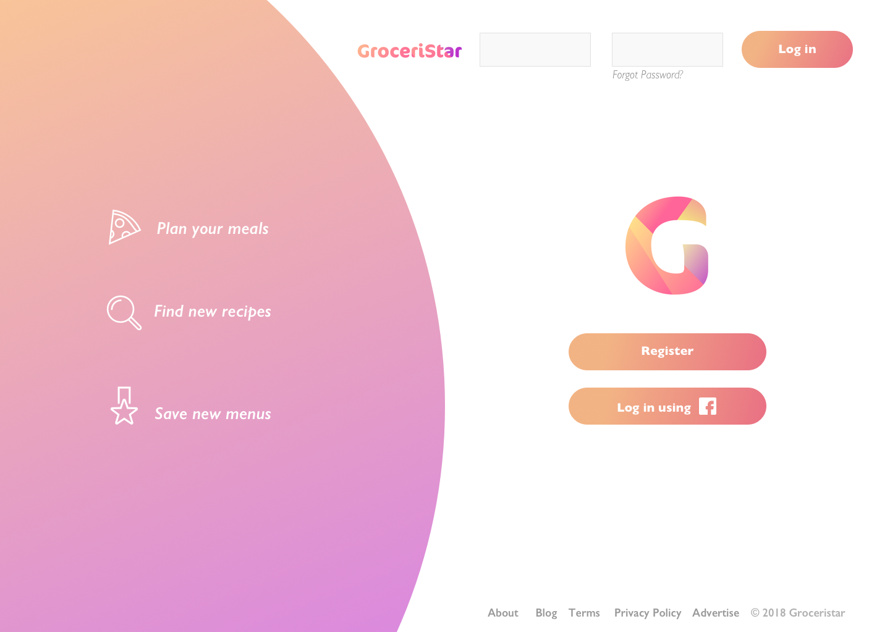
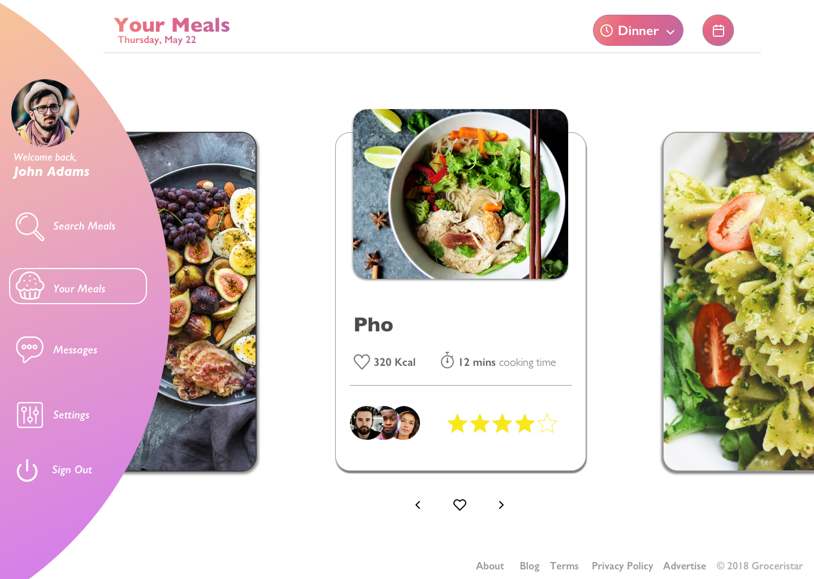
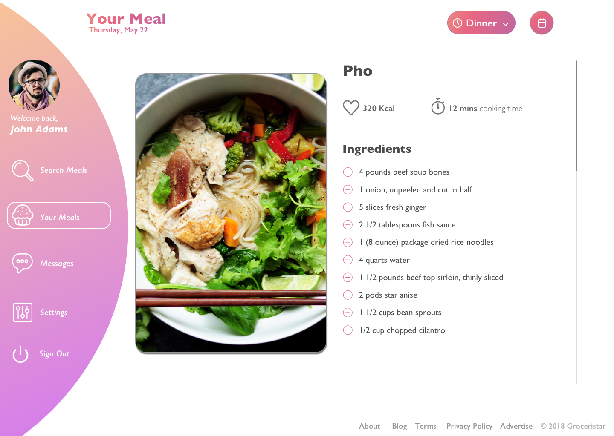
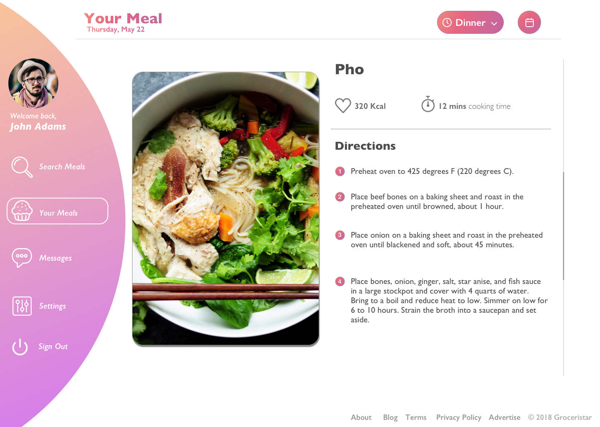
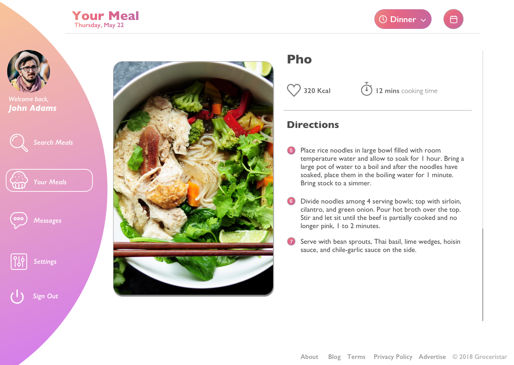

# Meal_Planning_UX
<html>
  <body>
<meta name="viewport" content="width=device-width, initial-scale=1.0">
    

      <h3> This is a project to showcase the sample UI design and UX flow for a meal planning web application </h3>
      
 This was designed using Sketch 

   

      
      
      
      
      
   
    
  </body>
</html>  
