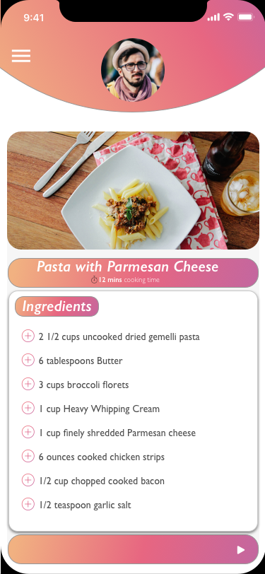

# Meal_Planning_UX_Mobile
UX Flow for a cross-platform Meal Planning Application - using Sketch and HTML

<meta name="viewport" content="width=device-width, initial-scale=1.0">
    

      <h3> This is a project to showcase the sample UI design and UX flow for a cross-platform mobile meal planning application </h3>
      
 This was designed using Sketch. 

<!--      <table>
      <tr>
<td>  </td>
<td>  </td> 
<td>  </td>
<td> </td> </tr>
<tr><td> </td>
<td> </td>
<td> </td>
<td> </td> </tr>
-->
<h3> Wireframe </h3>

</body>
</html>
